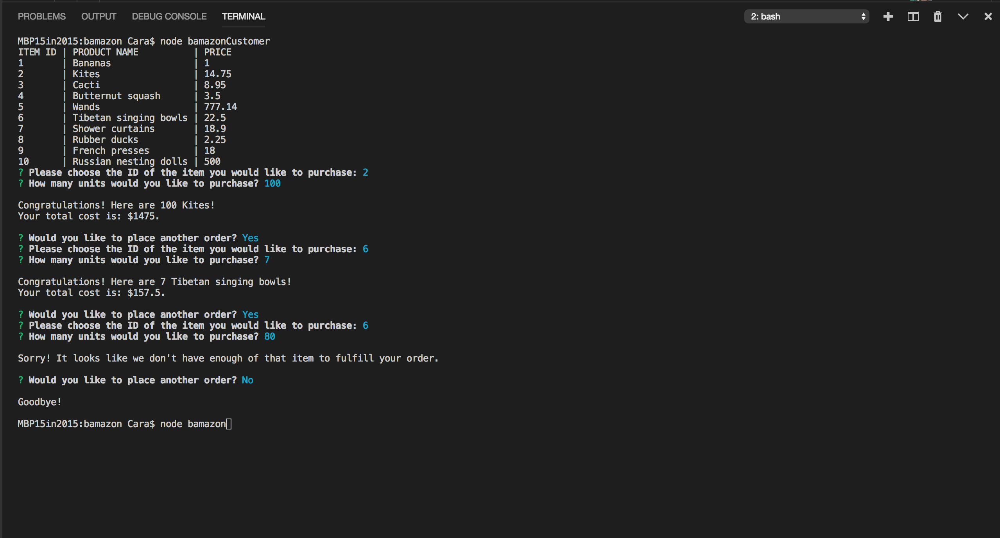
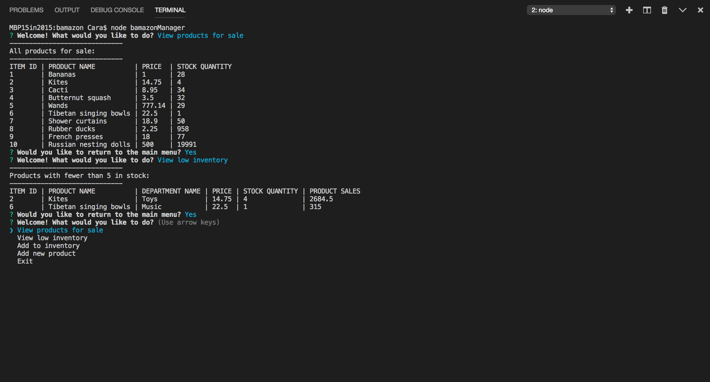

# Bamazon!

* The Bamazon app is an Amazon-like storefront that takes in orders from customers and accepts orders from managers and supervisors. Customers can view products for sale and purchase products; managers can view products for sale, view products with a low inventory, add inventory, and add new products; and supervisors can view product sales by department and create new departments. All of these changes are reflected in real time via the MySQL database.

* As a customer:
    - You are first given a list of products for sale.
    - Then you can choose which product you'd like to buy and the quantity you'd like to buy.
    - If there are enough of the product in stock to fulfill your order, you will receive a success message and the change in stock will be reflected in the database.
    - If there are not enough of the product in stock to fulfill your order, you will receive a message telling you that this is the case and your order will not go through.

* As a manager:
    - You are first given a menu of possible actions.
    - If you select "View products for sale," you will see all products for sale.
    - If you select "View low inventory," you will see all products with an inventory count lower than five.
    - If you select "Add to inventory," you will be able to select a product and add inventory to it.
    - If you select "Add new product," you will be able to place an order for a new product.
    - All changes will be reflected in the database.

* As a supervisor:
    - You are first given a menu of possible actions.
    - If you select "View product sales by department," you will see all products in stock, organized by department, with product sales and total profits calculated and listed.
    - If you select "Create a new department," you will be able to create a new department. Then, as a manager, you can add new products to this department.
    - All changes will be reflected in the database.

* Once you start up the app, Inquirer will use prompts to guide you through all possible functions.

* Bamazon includes user validation, so you cannot purchase a negative number of items, and you must use a numeric input for prompts that ask for a numeric input.

* This is a CLI app that uses JavaScript, Node, Inquirer, Columnify, and MySQL.

[Video of Bamazon in action](https://drive.google.com/file/d/1La8DIwED6sp2eB7n5woL2kx1muG6oUVM/view?usp=sharing)